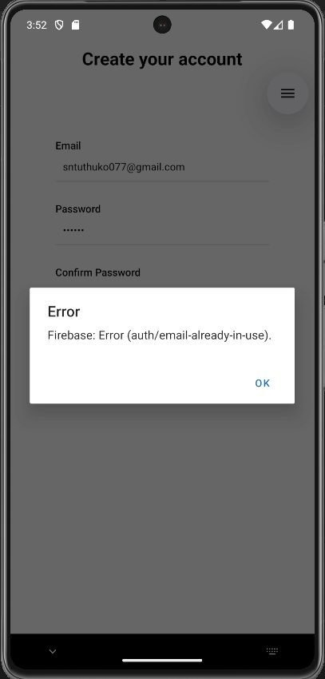

# carsForSale

An **Expo React Native** app for buying and selling cars. This app allows users to register, log in, and browse car listings. Built with **TypeScript** and **Firebase Authentication** for a secure and smooth user experience.

---

## Why carsForSale?

Buying and selling cars can be complicated and time-consuming. This app simplifies the process by providing a secure and easy-to-use mobile platform for users to browse, post, and manage car listings.

---

## Features

- User authentication with Email/Password via Firebase
- Form validation using **Formik** and **Yup**
- Navigation using **Expo Router**
- Responsive UI for mobile devices
- File-based routing for screens and components

---

## Tech Stack

- **React Native / Expo**
- **TypeScript**
- **Firebase** (Authentication)
- **Formik & Yup** for form handling and validation
- **Expo Router** for navigation

---

## Screenshots / Preview


*Sign up screen showing validation for existing users.*


*Confirmation screen after successful registration.*


*User login screen.*


*Browsing available cars with filters.*

---

## Getting Started

### Prerequisites

- Node.js (v20.11.1)
- npm (v9.9.4)
- Expo CLI (`npm install -g expo-cli`)
- Java JDK 11 (for Android emulator, if testing on Android)

---

### Installation

```bash
# Clone the repository
git clone https://github.com/Sakhisizwe/carsForSale.git

# Navigate to the project folder
cd carsForSale

# Install dependencies
npm install
```

---

### Running the App

```bash
# Start the Expo development server
npx expo start
```

You can open the app using any of the following options displayed in the Expo CLI:

* **Development Build**: Run a full development build on your device or emulator
* **Android Emulator**: Launch the app on an Android virtual device
* **iOS Simulator**: Launch the app on an iOS simulator (Mac only)
* **Expo Go**: Open a limited sandbox version of your app on your physical device

---

## Project Structure

```
carsForSale/
├─ app/               # Screens and components
├─ assets/            # Images, icons, fonts
├─ constants/         # App-wide constants
├─ hooks/             # Custom hooks
├─ utils/             # Types, validation schemas, helpers
├─ firebase.js        # Firebase configuration and auth setup
├─ app.json           # Expo app configuration
└─ README.md
```

---

## Contributing

1. Fork the repository
2. Create a new branch (`git checkout -b feature/my-feature`)
3. Make your changes and commit (`git commit -m "Add some feature"`)
4. Push to your branch (`git push origin feature/my-feature`)
5. Open a Pull Request

---

## License

This project is licensed under the MIT License.

---

## Acknowledgements

* [Expo Documentation](https://docs.expo.dev/)
* [Firebase Documentation](https://firebase.google.com/docs)
* [Formik Documentation](https://formik.org/docs/overview)
* [Yup Documentation](https://github.com/jquense/yup)

```

This is **all-in-one**: installation, running, and usage instructions included.  
